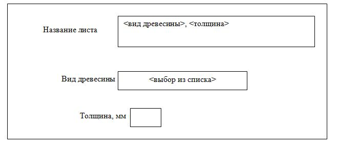
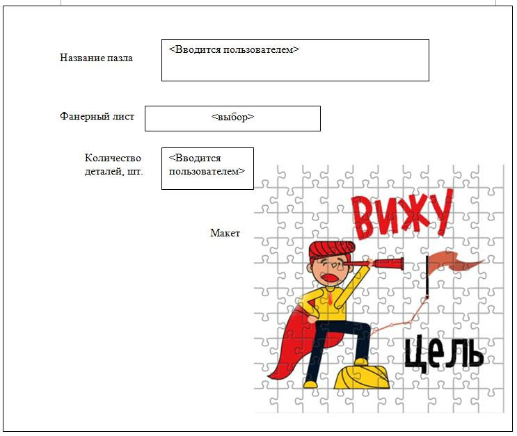
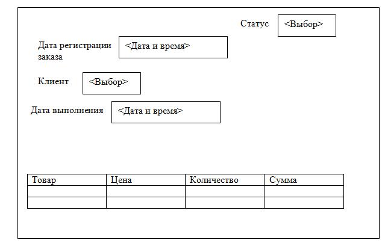
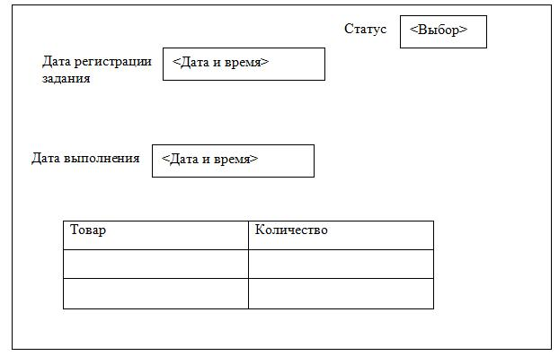

# Задача II тура Олимпиады

### *Легенда*

Дорогой друг!

Представь, что ты работаешь в крупной ИТ-компании по разработке программного обеспечения.

Твой отдел занимается разработкой компьютерных программ по автоматизации деятельности различных организаций. К вам обращаются различные компании, которые хотят привести в порядок свои технологические и управленческие процессы, а также
получать сводную аналитическую информацию о состоянии своего бизнеса.

К вам обратилась компания "Агаш Пазл", которая занимается изготовлением деревянных пазлов.

Создание деревянных пазлов на самом деле творческий и технологичный процесс.

Работа над пазлом начинается с художника, создающего уникальную и интересную картину. Которая впоследствии будет напечатана на бумаге и наклеена на дерево. Затем дизайнер подготавливает макет пазла - на компьютере с помощью специальной программы вырисовывает каждую деталь уникальной и неповторимой формы.

На производстве для изготовления пазлов подготавливаются различные листы. Они тщательно отшлифовываются до совершенно гладкого состояния, что позволяет нарезать пласт на цельные частички пазла, которые не сломаются в руках и не оставят заноз. Далее отшлифованная фанера очищается от пыли, и на неё наносится яркая наклейка с изображением пазла. После этого заготовка помещается в специальный станок, где лазер вырезает каждую деталь пазла, выверяя тонкие линии - это обеспечивает крепкую сцепку и отсутствие зазоров между фигурками.

Пазл готов! Далее он отправляется на упаковку.

Но для учета всех материалов, для отслеживания процессов изготовления пазлов, заказов клиентов используются до сих пор бумажные носители и простые электронные таблицы. Требуется создать программу, в которой бы велся учет материалов, продукции, заказов клиентов и их состояния, а также в ней можно бы было посмотреть сводную аналитическую информацию о состоянии деятельности компании.

Поскольку владельцы бизнеса не представляют, что собой будет представлять такая программа, развернутого технического задания вам они предоставить не могут.

Они описали свой технологический процесс и свои потребности в его автоматизации. По этому описанию нужно создать для них приложение.

Для твоего удобства описание разделено на части.

# 1. Создание приложения для заказчика и наполнение его справочной информацией

<u>Максимальное количество баллов: 30</u>

Деревянные пазлы изготавливаются из различных видов древесины, каждый из которых обладает своими характеристиками и преимуществами. Вот некоторые из наиболее популярных видов древесины, используемых для производства деревянных
пазлов:

- **Береза**: обладает высокой прочностью и жесткостью, имеет светлый цвет и однородную текстуру, что делает её идеальной для покраски и нанесения рисунков.

- **Сосна**: легкая и доступная древесина, имеет характерный запах и текстуру, обычно используется для бюджетных вариантов пазлов.

- **Клен**: очень прочная и твердая древесина, имеет светлый цвет и красивую
текстуру, что делает её популярной для высококачественных пазлов.

- **Махагон**: Экзотическая древесина с красивым красноватым оттенком, обладает хорошей устойчивостью к влаге и повреждениям.

- **Дуб**: известен своей прочностью и долговечностью, имеет характерную текстуру и цвет, что придаёт пазлам уникальный вид.

- **Липа**: легкая и мягкая древесина, легко обрабатывается, часто используется для детских пазлов из-за своей безопасности.

- **Тик**: экзотическая древесина с отличной устойчивостью к влаге, часто используется для изготовления высококачественных пазлов и игрушек.

- **Вишня**: имеет красивый красноватый оттенок, который темнеет со временем,
хорошо подходит для создания элегантных и стильных пазлов.

Выбор древесины зависит от целевой аудитории, предполагаемой цены, дизайна и других факторов. Каждая древесина имеет свои уникальные свойства, которые могут влиять на внешний вид и долговечность готового изделия. В будущую программу необходимо занести информацию о видах древесины, из которых изготавливаются пазлы. Этот перечень исчерпывающий, другие виды древесины использовать не планируется.

Из древесины на производстве изготавливаются листы, из которых потом вырезаются пазлы. Фанерные листы для изготовления пазлов быть различной толщины, в зависимости от требований к прочности и детализации. В компании используются следующие размеры толщины:

- *3 мм*: это стандартная толщина для легких пазлов, которые предназначены для детей или начинающих. Они достаточно прочные, но при этом легкие.

- *4 мм*: эта толщина обеспечивает хорошую прочность и стабильность, что делает её популярной для большинства пазлов.

- *6 мм*: такой размер используется для более крупных и сложных пазлов, где требуется дополнительная прочность и устойчивость.

- *9 мм*: пазлы такой толщины могут использоваться для специальных или крупных пазлов, а также для пазлов с объемными элементами.

Выбор толщины фанеры зависит от дизайна пазла, его размера и целевой аудитории. Более толстые листы обеспечивают большую прочность и долговечность, но могут быть менее удобными для хранения и использования. В будущей программе необходимо хранить информацию о фанерных листах разной толщины, изготавливаемой из различных видов древесины.

*Для каждого фанерного листа необходима карточка, где будет храниться*:

- [x] Название
- [x] Вид древесины
- [x] Толщина

Название проставляется автоматически и складывается из вида древесины и размера (но с возможностью это наименование поправить, если что).

**Карточка листа выглядит так**:

В новой программе также должна храниться информация обо всех выпускаемых пазах. Карточка пазла должна содержать информацию о названии, количестве деталей, используемом фанерном листе,  изображение макета. Макет представляет собой
картинку, "изрезанную на части". Карточка должна выглядит так:

Приложение должно быть заполнено тестовыми данными: введены все виды древесины, все толщины, 6 фанерных листов, 6 пазлов. Для пазлов можно использовать любые картинки, макет можно сделать любым онлайн-конструктором пазлов.

# 2. Создание прайс-листа

<u>Максимальное количество баллов: 40</u>

Любое предприятие должно знакомить своих заказчиков с номенклатурой своей продукции и ценами на нее. Поэтому следующим заданием будет разработка отчета "Прайс-лист".

Цены на пазлы устанавливаются экономистами компании на основании их расчетов. Проставляют менеджеры их самостоятельно. Но цены могут меняться с течением времени – старые цены перестают действовать, устанавливаются новые. В прайс-листе важно отображать текущие (действующие цены). Для удобства необходимо сделать так, чтобы действующую цену можно было бы посмотреть из карточки пазла.

# 3. Автоматизация работы с клиентами

<u>Максимальное количество баллов: 70</u>

- [x] Клиент выбирается из списка.

- [x] Дата выполнения (не меньше текущей).

- [ ] В табличной части пазлы выбираются из списка, цена добавляется из прайс-листа, количество проставляется вручную, сумма рассчитывается автоматически.

Заказ подписывается клиентом – другими словами, он переходит в состояние "Согласован с клиентом". Без подписи клиента заказ – просто черновик.

В программе подписи ставить не надо, можно управлять состоянием при помощи статусов:

**Первые два статуса устанавливаются вручную, остальные статусы отслеживает и устанавливает система.**

- **Черновик**: просто "черновик" документа, никакой силы не имеет, заранее
создали заказ на всякий случай.

- **Согласовано с клиентом**: клиент утвердил заказ и ждет отгрузки товаров.

- **На производстве**: заказ отдан в производство.

- **Готов к отгрузке**: заказ готов, можно забирать.

- **Отгружен клиенту**: заказ забрал клиент.

Карточка заказа выглядит приблизительно так,
как показано на рисунке ниже:

# 4. Автоматизация процессов производства и отгрузки товаров

<u>Максимальное количество баллов: 60</u>

Оформленный заказ относят на производство. По этому заказу составляется Задание на производство. Вся информация берется из заказа. Форма Задания на производство представлена на рисунке ниже.

У задания на производства два состояния, которые можно определить статусами – "Принято в производство" и "Выполнен". Статус "Принят в производство" меняет состояние заказа клиента в статус "На производстве".

Как только задание на производство выполнено, и у него появляется статус "Выполнено", это влечет собой изменение состояния заказа клиента в статус "Готов к отгрузке".

После того, как заказ готов к отгрузке, менеджер компании сообщает об этом клиенту, клиент забирает заказ. По факту отгрузки составляется отдельный документ, вся информация (кроме даты выполнения и даты регистрации заказа) копируется из Заказа клиента. В документ отгрузки всегда проставляется текущая дата отгрузки. После оформления документа отгрузки у Заказа клиента проставляется статус "Отгружено клиенту".

# 5. Отображение аналитической информации.

<u>Максимальное количество баллов: 60</u>

### Информацию по продажам пазлов:

- [ ] Выводиться за период.

- [ ] Должна быть возможность делать отбор по определенному товару.

- [x] Наименование проданных товаров.

- [x] Количество.

- [x] Сумму.

#### Вывод в виде:

- [ ] Таблички.

- [ ] Диаграммы.

### Информация для менеджеров:

- [ ] Необходимо выводить общую информацию по товарам, которые сейчас на производстве ("Принято на производство").

- [ ] Информацию нужно выводить на дату.

- [ ] C указанием даты выполнения.

- [ ] Если срок выполнения истекает на следующий день, такие позиции подсвечивать красным.
